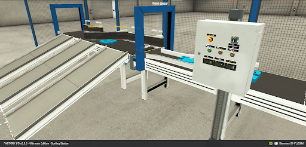

 ## 1.Especificação do trabalho:

Uma fábrica busca automatizar o processo de uma estação de classificação, com o objetivo de separar peças numeradas de 1 a 6, conforme ilustrado na figura abaixo. As peças serão direcionadas para três recipientes distintos por meio de separadores em uma esteira transportadora. Esses separadores guiarão as peças até as saídas desejadas. As peças numeradas como 1 e 4 (com suporte Azul/Verde) serão depositadas no recipiente 1 (saída 1), as peças 2 e 5 (com tampa Azul/Verde) serão encaminhadas para a saída 2, e as peças 3 e 6 (com base Azul/Verde) serão destinadas à saída 3.

O processo se inicia quando o botão "Start" no Controlador Lógico Programável (CLP) é pressionado, ativando a “Esteira de entrada” que conduzirá as peças até um “Sensor de visão” responsável por identificar a peça de acordo com seu número. Assim que a peça for identificada, a comporta que estava fechada se abrirá, permitindo que a peça siga para a etapa de triagem na “Esteira de saída”, onde será direcionada pelas divisórias até o recipiente correto.

  
  

Quando o sensor identificar uma peça numerada como 1 ou 4, o seletor (divisória) Sorter Turn 1 e a esteira Sorter Belt 1 serão acionados simultaneamente por 4 segundos, até que a triagem seja concluída e a peça, seja corretamente direcionada para o recipiente adequado. Da mesma forma, para as peças 2 ou 5, o seletor Sorter Turn 2 e a esteira Sorter Belt 2 serão acionados por 6 segundos. E para as peças 3 ou 6, o seletor Sorter Turn 3 e a esteira Sorter Belt 3 serão acionados por 8 segundos, garantindo o término da triagem. Após cada ciclo de triagem, a comporta será fechada, e a “Esteira de entrada” será reiniciada, aguardando a identificação de uma nova peça pelo sensor.
Além disso, sempre que o botão "Stop" for pressionado, a “Esteira de entrada” será interrompida até que o botão "Start" seja pressionado novamente. Um botão de emergência também foi implementado, o qual parará todo o processo quando pressionado, permanecendo nesse estado até ser desativado e o botão "Start" for pressionado novamente para reiniciar a triagem.

Após a classificação das peças e sua direção para as respectivas saídas, a quantidade de peças passando pela triagem será contabilizada por meio de um contador digital no CLP. O Contador 1 (Cont 1) registrará o número de peças na saída 1, o Contador 2 (Cont 2) na saída 2 e assim por diante. Esses contadores podem ser zerados ao pressionar o botão de “Reset” no CLP.

  
  

## 2. Tabelas da verdade

Sendo a tabela verdade da estação de classificação descrita abaixo, temos:

| Entradas (I) | Saída (Q) | St | Sp | E | R | SV | EE | ES | C | DV 1 | DV 2 | DV 3 | C1 | C2 | C3 |
|--------------|-----------|----|----|---|---|----|----|----|---|------|------|------|----|----|----|
| 1            | 0         | 0  | 0  | 0 | 1 | 0  | 1  | 0  | 0 | x    | x    | x    | 1  | 0  | 0  |
| 0            | 1         | 0  | 0  | 1 | 0 | 1  | 0  | 1  | 0 | x    | x    | x    | 1  | 0  | 0  |
| 0            | 2         | 0  | 0  | 0 | 1 | 0  | 1  | 0  | 0 | x    | x    | x    | 1  | 0  | 0  |
| 0            | 3         | 0  | 0  | 0 | 1 | 0  | 1  | 0  | 0 | x    | x    | x    | 1  | 0  | 0  |
| 0            | 4         | 0  | 0  | 1 | 0 | 1  | 0  | 1  | 0 | x    | x    | x    | 1  | 0  | 0  |
| 0            | 5         | 0  | 0  | 0 | 1 | 0  | 1  | 0  | 0 | x    | x    | x    | 1  | 0  | 0  |
| 0            | 6         | 0  | 0  | 0 | 1 | 0  | 1  | 0  | 0 | x    | x    | x    | 0  | 1  | 0  |
| 0            | 0         | x  | 0  | x | x | x  | x  | x  | x | x    | x    | x    | 0  | 0  | 1  |
| 0            | 0         | 0  | 0  | 0 | 0 | 0  | 0  | 0  | 0 | x    | x    | x    | x  | 0  | 0  |
| 1            | 0         | x  | x  | x | x | x  | x  | x  | x | x    | 0    | 0    | 0  | 0  | 0  |

Legenda:

St: Start
Sp: Stop
R: Reset
E: Emergência 
SV: Sensor de Visão
EE: Esteira Entrada
ES: Esteira Saída
C: Comporta

DV 1: Divisória 1(Sorter Turn 1 e Sorter Belt 1)
DV 2: Divisória 2(Sorter Turn 2 e Sorter Belt 2)
DV 3: Divisória 3(Sorter Turn 3 e Sorter Belt 3)
C1: Contador 1
C2: Contador 2
C3: Contador 3

## 3. Tabela de Endereçamento:

| Nome                | Type | Endereço  |
|---------------------|------|-----------|
| ESTEIRA             | Bool | %Q0.0     |
| SORTER TURN 2       | Bool | %Q0.5     |
| START               | Bool | %I0.1     |
| SORTER TURN 3       | Bool | %Q0.7     |
| RESET               | Bool | %I0.2     |
| SORTER BELT 2       | Bool | %Q0.6     |
| STOP                | Bool | %I0.3     |
| SORTER BELT 3       | Bool | %Q1.0     |
| SENSOR VISÃO        | DInt | %ID30     |
| EMERGÊNCIA          | Bool | %I0.4     |
| SORTER TURN 1       | Bool | %Q0.3     |
| INICIA O PROCESSO   | Bool | %M0.5     |
| SORTER BELT 1       | Bool | %Q0.4     |
| STOP NÃO PRESSIONADO| Bool | %M0.6     |
| ESTEIRA SAÍDA       | Bool | %Q0.2     |
| PEÇA IDENTIFICADA   | Bool | %M0.7     |
| COMPORTA            | Bool | %Q0.1     |
| BYTES SAÍDA 0       | Byte | %QB0      |
| PEÇA TIPO 1 OU 4    | Bool | %M0.0     |
| BYTES SAÍDA 1       | Byte | %QB1      |
| TRIAGEM CONCLUÍDA   | Bool | %M0.1     |
| CONT 1              | DInt | %QD30     |
| PEÇA TIPO 2 OU 5    | Bool | %M0.2     |
| CONT 2              | DInt | %QD34     |
| PEÇA TIPO 3 OU 6    | Bool | %M0.3     |
| CONT 3              | DInt | %QD38     |

## 4. Código LAD: 

Github: https://github.com/MoniqueMoreira/Sorting_Station
